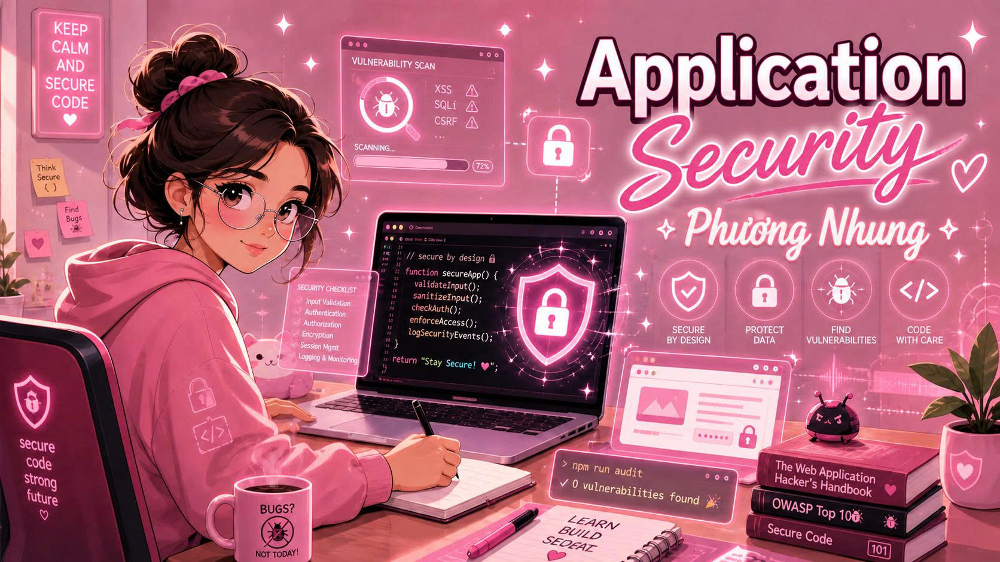

  

  

  

  

  🎓 <strong>Cyber Security Student</strong>   
  🔐 Passionate about <strong>Application Security and Secure Software Development</strong>   
  💡 Interested in building secure, reliable, and user-focused software systems   
  🚀 Goal: Become a professional <strong>Application Security Engineer</strong>

 

  

  <a href="#english">🇺🇸 English</a> |
  <a href="#tieng-viet">🇻🇳 Tiếng Việt</a>

---

  

I am an **Information Technology student** with a strong interest in **Application Security**, **secure software development**, and **cybersecurity fundamentals**.

My learning journey focuses on understanding how modern applications are designed, how security vulnerabilities appear, and how developers can build safer and more reliable software systems. I am especially interested in web application security, secure coding practices, vulnerability analysis, and practical security testing.

I am continuously improving my technical skills through academic learning, self-study, hands-on practice, and personal projects related to software development and cybersecurity.

 

---

  

- Application Security
- Web Application Security
- Secure Software Development
- Secure Coding Practices
- Vulnerability Assessment
- Basic Penetration Testing
- OWASP Top 10 Security Risks
- Authentication and Authorization
- Software Testing and Risk Analysis

 

---

  

  

  

  

  
  

  

  
  
  

  

  
  
  
  

---

  

I am currently building my foundation in the following security topics:

- OWASP Top 10
- Web Application Security
- Secure Coding Principles
- Vulnerability Analysis
- Input Validation
- SQL Injection Prevention
- Cross-Site Scripting Awareness
- Authentication and Authorization Basics
- Basic Penetration Testing Concepts
- Security Testing Methodologies

---

  

- Secure Web Application Development
- Cybersecurity Fundamentals
- Vulnerability Testing Techniques
- Network and System Security Basics
- Secure Coding Best Practices
- Practical Security Tools
- Software Development Best Practices

---

  

My goal is to become a skilled **Application Security Engineer** with the ability to analyze, assess, and improve the security of software systems.

I aim to develop a strong foundation in both **software development** and **cybersecurity**, allowing me to contribute to the creation of secure, stable, and trustworthy applications. In the future, I hope to work in a professional technology environment where I can continue learning, solve real-world security challenges, and make meaningful contributions to software security.

---

  

- Strong willingness to learn
- Detail-oriented mindset
- Logical thinking and problem-solving skills
- Interest in security research
- Responsibility and teamwork
- Continuous self-improvement
- Ability to adapt to new technologies

---

  

  

Xin chào, tôi là **Nguyễn Thị Phương Nhung**, sinh viên ngành **An toàn Thông tin** với định hướng chuyên sâu về **Bảo mật Ứng dụng**.

Tôi quan tâm đến việc xây dựng các hệ thống phần mềm an toàn, ổn định và đáng tin cậy. Trong quá trình học tập, tôi tập trung tìm hiểu cách các ứng dụng được phát triển, cách các lỗ hổng bảo mật xuất hiện và những phương pháp giúp giảm thiểu rủi ro bảo mật trong phần mềm.

---

  

- Tôi là sinh viên ngành **Công nghệ Thông tin**.
- Tôi có định hướng phát triển trong lĩnh vực **Application Security**.
- Tôi quan tâm đến **bảo mật ứng dụng web**, **lập trình an toàn** và **kiểm thử bảo mật phần mềm**.
- Tôi luôn chủ động học hỏi các kiến thức mới về phát triển phần mềm và an toàn thông tin.
- Mục tiêu của tôi là xây dựng nền tảng vững chắc về cả **lập trình** và **an ninh mạng**.

---

  

- Bảo mật ứng dụng
- Bảo mật ứng dụng web
- Lập trình an toàn
- Phân tích lỗ hổng bảo mật
- Kiểm thử bảo mật cơ bản
- OWASP Top 10
- Xác thực và phân quyền
- Đánh giá rủi ro trong phần mềm

---

  

- **Ngôn ngữ lập trình:** C/C++, Java, Python, JavaScript
- **Phát triển Web:** HTML, CSS, JavaScript
- **Cơ sở dữ liệu:** MySQL, SQL cơ bản
- **Công cụ:** Git, GitHub, Visual Studio Code, Linux
- **Bảo mật ứng dụng:** OWASP Top 10, Burp Suite, Secure Coding, Web Security

---

  

Hiện tại, tôi đang tập trung nâng cao kiến thức trong các lĩnh vực:

- Phát triển ứng dụng web an toàn
- Nguyên tắc lập trình an toàn
- Kiến thức nền tảng về an ninh mạng
- Phân tích và kiểm thử lỗ hổng bảo mật
- SQL Injection và Cross-Site Scripting
- Xác thực, phân quyền và kiểm soát truy cập
- Sử dụng các công cụ hỗ trợ kiểm thử bảo mật

---

  

Mục tiêu của tôi là trở thành một **Application Security Engineer** có khả năng phân tích, đánh giá và cải thiện mức độ an toàn của các hệ thống phần mềm.

Tôi mong muốn phát triển bản thân trong môi trường công nghệ chuyên nghiệp, không ngừng học hỏi và đóng góp vào việc xây dựng các ứng dụng an toàn, ổn định và mang lại giá trị thực tế cho người dùng.

---

  

- Tinh thần học hỏi cao
- Tư duy logic và giải quyết vấn đề
- Cẩn thận, chú ý đến chi tiết
- Quan tâm đến nghiên cứu bảo mật
- Có trách nhiệm trong học tập và công việc nhóm
- Sẵn sàng thích nghi với công nghệ mới

---

  

---

  

---

  

