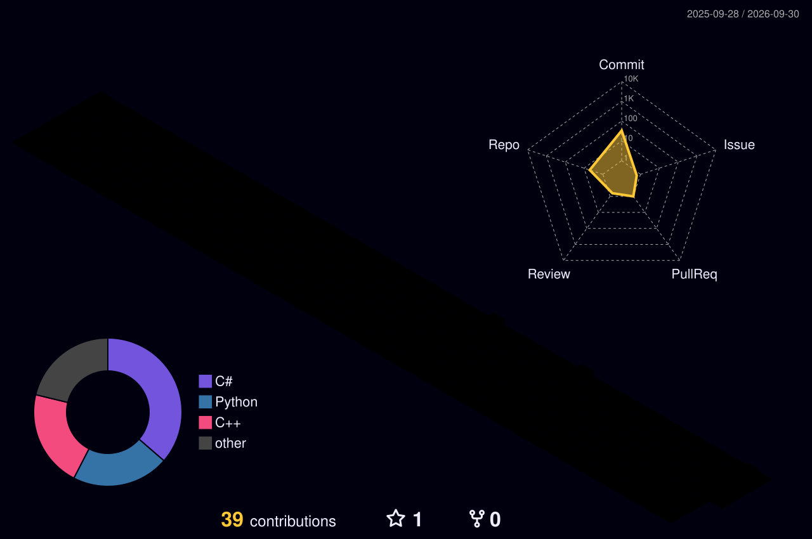

  

<!-- PHẦN TÊN -->

  

  

<!-- KẾT THÚC PHẦN TIÊU ĐỀ -->

  

<!-- PHẦN ABOUT ME  -->

### 🌸 About Me
    
Hi there! I'm **Nguyen Thi Phuong Nhung**, a passionate Tech Student focusing on **Cyber Security & Application Security**. 
    
I love exploring how web applications work, analyzing vulnerabilities, and learning how to build safer software systems.

 

  &nbsp;&nbsp;
    
  &nbsp;&nbsp;

 

  

### 🚀 Tech Stack & Focus

  <strong>Programming & Development</strong> 
    
  <strong>Tools & Environment</strong> 
    
  <strong>Security Focus</strong> 
  
  
  
  

  

### 📈 Stats & Streak

  <a href="https://github.com/pon0212">
    

  

### 📊 GitHub Stats & Animations

<!-- Biểu đồ 3D Contribution -->

  

<!-- Contribution Snake -->

  <picture>
    <source media="(prefers-color-scheme: dark)" srcset="dist/github-contribution-grid-snake-dark.svg">
    <source media="(prefers-color-scheme: light)" srcset="dist/github-contribution-grid-snake.svg">
    
  </picture>

  <blockquote>
    <em>"Never say all you know. And never believe all you hear." - PoN </em>
  </blockquote>

  

  

### 📫 Let's Connect!

  
  
  

  

