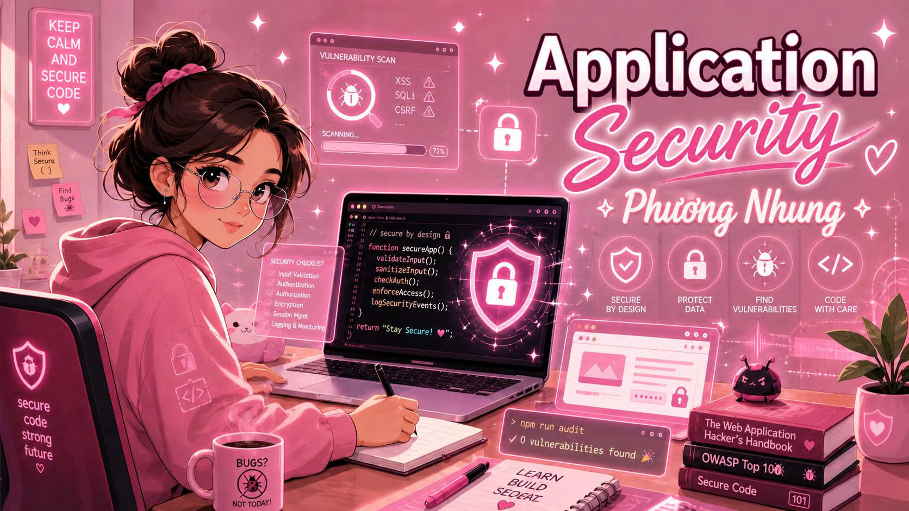

  

  

  

  👋 <strong>Hello, I'm Nguyen Thi Phuong Nhung!</strong>   
  🎓 <strong>Cyber Security Student</strong> with a passion for <strong>Application Security</strong> and <strong>Secure Software Development</strong>.  
  💡 I focus on understanding how modern applications are designed, how vulnerabilities appear, and how to build safer, more reliable systems.  
  🚀 <strong>Goal:</strong> Become a professional <strong>Application Security Engineer</strong>. 

 

  <a href="#english">🇺🇸 English</a> | <a href="#tieng-viet">🇻🇳 Tiếng Việt</a>

---

### 🚀 Tech Stack & Focus

  <strong>Programming & Development</strong> 
    
  <strong>Tools & Environment</strong> 
    
  <strong>Security Focus</strong> 
  
  
  
  

- **Currently Learning:** Web App Security, Secure Coding Principles, Vulnerability Analysis (SQLi, XSS), Penetration Testing Basics.
- **Strengths:** Eager to learn, detail-oriented, logical problem-solving, and highly responsible.

---

🇻🇳 <b>Xem phần giới thiệu bằng Tiếng Việt (Click to expand)</b>

 

Xin chào, tôi là **Nguyễn Thị Phương Nhung**, sinh viên ngành **An toàn Thông tin** với định hướng chuyên sâu về **Bảo mật Ứng dụng (Application Security)**.

- 🎯 **Mục tiêu:** Xây dựng nền tảng vững chắc về lập trình và an ninh mạng để trở thành một Application Security Engineer chuyên nghiệp.
- 📚 **Đang tìm hiểu:** Bảo mật ứng dụng web, OWASP Top 10, phân tích lỗ hổng (SQLi, XSS), xác thực/phân quyền và kiểm thử bảo mật cơ bản.
- 💻 **Kỹ năng:** C/C++, Java, Python, JavaScript, Git, Linux, MySQL, Burp Suite.
- ✨ **Điểm mạnh:** Tinh thần học hỏi cao, tư duy logic, cẩn thận và có trách nhiệm trong công việc.

---

### 📊 GitHub Stats & Animations

  

<!-- CÚP THÀNH TỰU -->

  

<!-- THẺ THỐNG KÊ & NGÔN NGỮ -->

  
  

<!-- Contribution Snake -->

  <picture>
    <source media="(prefers-color-scheme: dark)" srcset="dist/github-contribution-grid-snake-dark.svg">
    <source media="(prefers-color-scheme: light)" srcset="dist/github-contribution-grid-snake.svg">
    
  </picture>

---

### 📫 Let's Connect!

  

